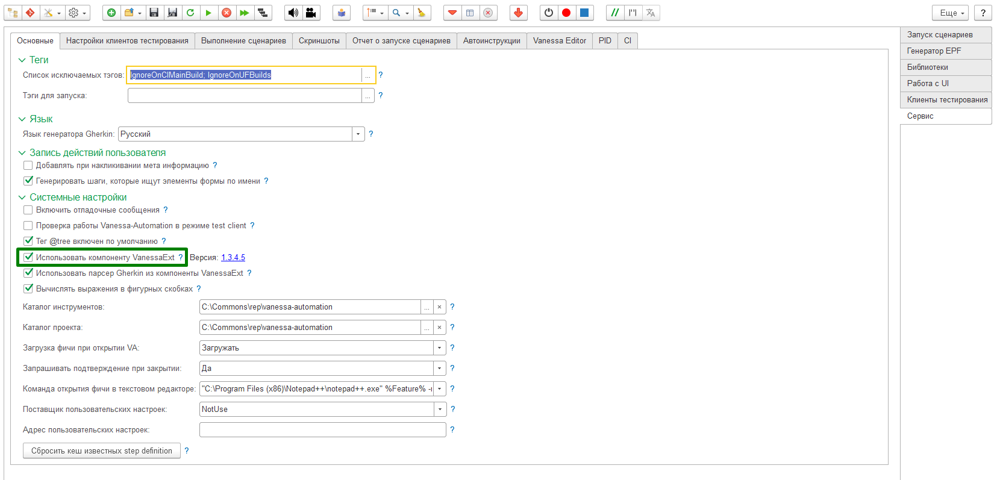
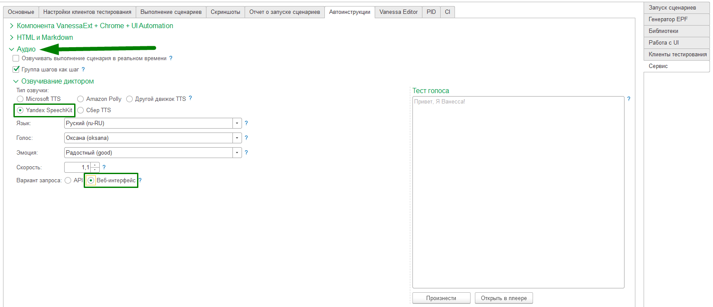
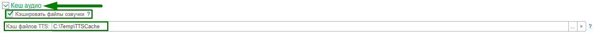

# Как настроить работу интерактивной справки

* Для работы интерактивной справки необходимо включить использование внешней компоненты [VanessaExt](https://github.com/lintest/VanessaExt/releases).

​

* Для работы интерактивной справки необходимо, чтобы у вас был настроен и работал синтез речи.
Это делается на закладке "Автоинструкуции" в группе "Аудио".
Минимальные настройки для синтеза речи показаны на скриншоте.

​
   
* Если вы  хотите использовать уже сгенерированные mp3 файлы для озвучки, тогда нужно задать настройки генерации речи в точности так как это показано на скринщоте. Также надо скачать с секции релизов архив с mp3 файлами и указать путь к нему в настройке, определяющей каталог кеш файлов mp3.

​

* Но конечно лучше получить ключ для какого-либо движка синтеза речи и указать соответствующие настройки.

* Проверить, что синтез голоса работает можно в окошке "Тест голоса".

* Также рекомендуется включить кеширования аудио файлов, чтобы при повторе урока mp3 файл был получен из кэша.
​