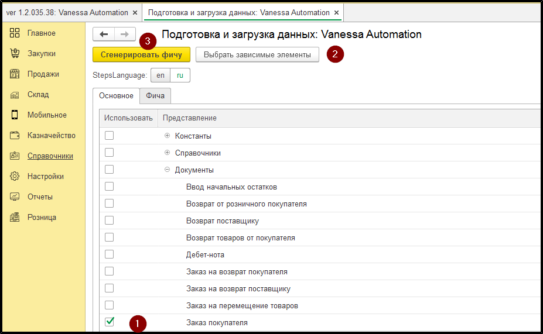
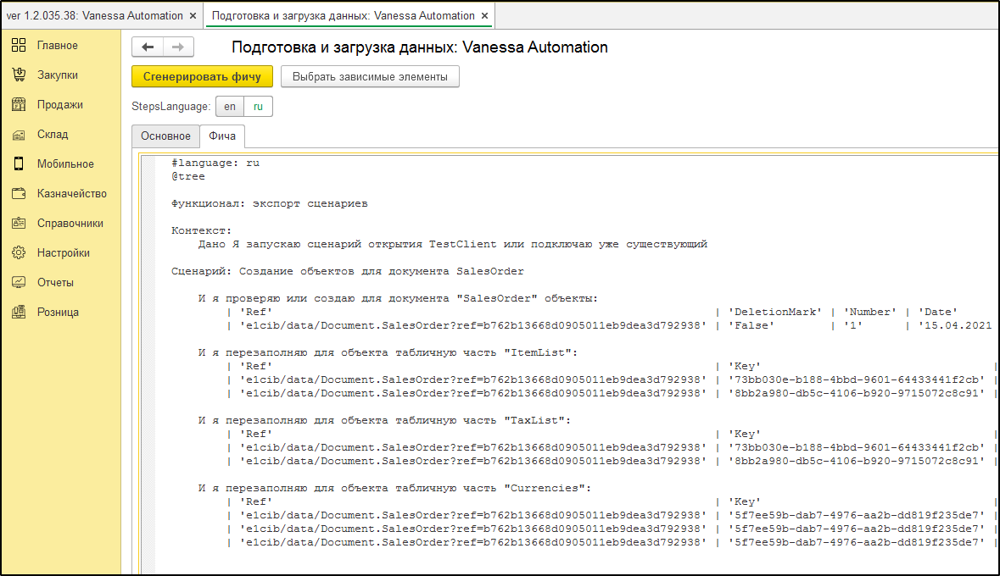

# Подготовка и загрузка данных

**Обработка "Подготовка и загрузка данных"** предназначена для автоматизации подготовки тестовых данных в виде сценариев и их загрузки при тестировании.

## Применение обработки
1. Необходимо открыть обработку из VA в базе в которой уже подготовлены тестовые данные
   ​

2. Галочками выбрать нужные объекты и сгенерировать фича файл

   
3. При необходимости выбрать все зависимые элементы с помощью кнопки "Выбрать зависимые элементы". В случае с заказом клиента при нажатии на эту кнопку галочки также проставятся напротив Номенклатуры, Партнера, Соглашения, Склада, Организации и т.д.

4. Сохранить файл с сгенерированными сценариями 
    

Данный файл используется в виде библиотеки экспортных сценариев для загрузки тестовых данных.

С примером написания тестов по такому принципу можно ознакомиться по [ссылке](https://github.com/IRPTeam/IRP/tree/develop/features/Internal).