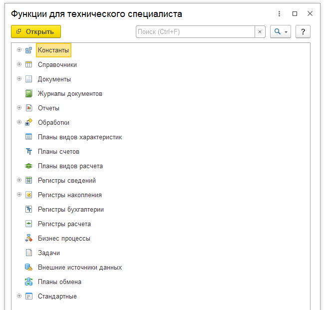
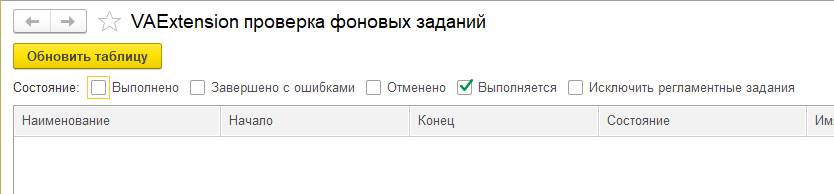
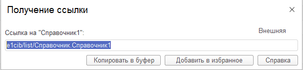
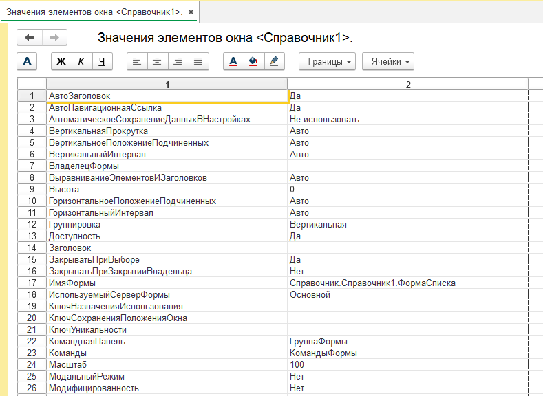
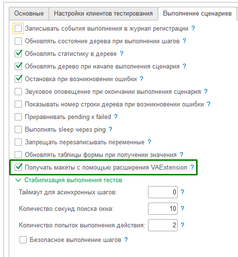
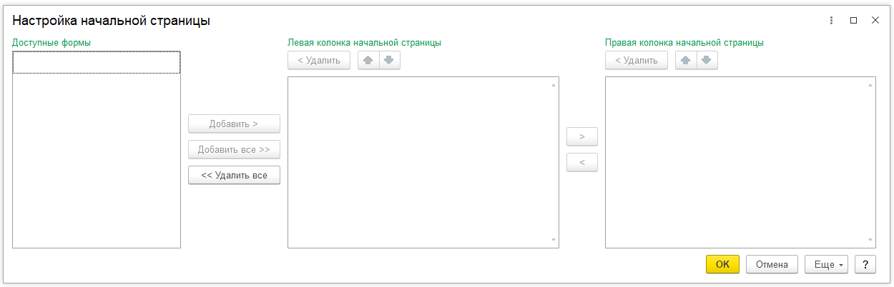

# Расширение VAExtension

**Расширение "VAExtension"** предназначено для решения ряда технологичесих задач при запуске автотестов.
Его необходимо установить в базу, в которой будет запускаться клиент тестирования.
Исходники расширения можно скачать [тут](https://github.com/Pr-Mex/vanessa-automation/tree/develop/lib/VAExtension).
Собранный cfe файл можно скачать в [секции релизов](https://github.com/Pr-Mex/vanessa-automation/releases).
Возможности расширения:
1. Открытие окна "Функции технического специалиста" (Все функции).
2. Выполнить ожидание завершения фоновых заданий на стороне клиента тестирования.
3. Получить навигационную ссылку окна для любых окон, у которых возможно получить навигационную ссылку.
4. Выполнить произвольный код на стороне клиента тестирования (клиентский код и серверный код).
5. Вычислить произвольное выражение на стороне клиента тестирования (клиентский код и серверный код).
6. Получить произвольное значение из реквизита формы или объекта связанного с формой.
7. Изменять произвольные данные формы, доступные для записи.
8. Выполнить метод текущей формы.
9. Получать макеты из формы клиента тестирования без использования временных файлов. Также работает в web клиенте.
10. Открытие окна "Настройка начальной страницы"
11. Взаимодействие с активным окном.
12. Сортировка таблиц динамических списков
13. Очистка табличного документа


## 1. Открытие окна "Функции технического специалиста" (Все функции).
Нужно использовать шаг
```Gherkin
   И я открываю окно функции для технического специалиста (расширение)
```
​


## 2. Выполнить ожидание завершения фоновых заданий на стороне клиента тестирования.
Нужно использовать шаги
```Gherkin
   И Я жду завершения выполнения всех фоновых заданий (Расширение)
   И Я жду завершения выполнения всех фоновых заданий в течение 100 секунд (Расширение)
```
​

## 3. Получить навигационную ссылку окна для любых окон, у которых возможно получить навигационную ссылку.
Нужно использовать шаг
```Gherkin
   И я сохраняю навигационную ссылку текущего окна в переменную "ИмяПеременной" (Расширение)
```
​


## 4. Выполнить произвольный код на стороне клиента тестирования (клиентский код и серверный код).
Нужно использовать шаги
```Gherkin
   И я выполняю код встроенного языка (Расширение)
   И я выполняю код встроенного языка на сервере (Расширение)
```

## 5. Вычислить произвольное выражение на стороне клиента тестирования (клиентский код и серверный код).
Нужно использовать шаги
```Gherkin
   И Я запоминаю значение выражения 'ВыражениеВстроенногоЯзыка' в переменную "ИмяПеременной" (Расширение)
   И Я запоминаю значение выражения на сервере 'ВыражениеВстроенногоЯзыка' в переменную "ИмяПеременной" (Расширение)
```

## 6.1 Получить произвольное значение из реквизита формы, объекта связанного с формой.
Для вывода текущих значений активного окна клиента тестирования нужно выполнить шаг. При этом на стороне менеджера тестирования появится печатная форма. Данный шаг нужно использовать для отладки и не нужно использовать в реальных сценариях.
```Gherkin
   И я вывожу данные текущего окна (Расширение)
```
​


## 6.2 Получить произвольное значение из реквизита формы, объекта связанного с формой.
Для получения значения произвольного реквизита формы нужно выполнить шаг.
```Gherkin
   И Я запоминаю значение текущего окна 'ВыражениеВстроенногоЯзыка' в переменную "ИмяПеременной" (Расширение)
```
Выражение пишется в виде "_ТекущееОкно.Объект.ПометкаУдаления" или "_CurrentWindow.Object.DeletionMark".


## 7. Изменять произвольные данные формы, доступные для записи.
Для изменения значения произвольного реквизита текушей формы нужно выполнить шаг.
```Gherkin
   И я выполняю выражение "ВыражениеВстроенногоЯзыка" в текущем окне (Расширение)
```
 Выражение пишется в виде '_ТекущееОкно.Заголовок = "Новый заголовок"' или '_CurrentWindow.Caption = "New caption"'.


## 8. Выполнить метод текущей формы.
Для выполнения произвольного метода текщей формы нужно выполнить шаг.
```Gherkin
   И я выполняю выражение "ВыражениеВстроенногоЯзыка" в текущем окне (Расширение)
```
 Выражение пишется в виде '_ТекущееОкно.ОткрытьСправкуФормы()' или '_CurrentWindow.ОткрытьСправкуФормы()'.


## 9. Получать макеты из формы клиента тестирования без использования временных файлов. Также работает в web клиенте.
​
При включении данной опции макеты, которые получает Vanessa Automation из клиента тестирования будут передаваться на сторону менеджера тестирования с помощью расширения. Это позволяет обойти проблему, что из web клиента макет можно прочитать только по ячейкам.
При написании собственных шагов, работающих с табличными документами нужно использовать метод
```BSL
   Ванесса.ПолучитьТабличныйДокументTestClient(ЭлементФормы)
```

## 10. Открытие окна "Настройка начальной страницы.
Нужно использовать шаг
```Gherkin
   И я открываю окно настройка начальной страницы (расширение)
```
​


## 11. Взаимодействие с активным окном.
Нужно использовать шаги
```Gherkin
	И я запоминаю текущее окно как "ЗаголовокОкна"
	И я выполняю код встроенного языка ( Расширение )
	"""bsl
		ТекОкно = VAExtensionКлиент.ПолучитьОкноПоЗаголовку("$ЗаголовокОкна$");
		Список = ТекОкно.Список;

		Сортировка = Список.КомпоновщикНастроек.Настройки.Порядок.Элементы;
		Сортировка.Очистить();

		УсловиеСортировки = Сортировка.Добавить(Тип("ЭлементПорядкаКомпоновкиДанных"));
		УсловиеСортировки.Поле = Новый ПолеКомпоновкиДанных("Код");
		УсловиеСортировки.ТипУпорядочивания = НаправлениеСортировкиКомпоновкиДанных.Возр;
		Список.КомпоновщикНастроек.ЗагрузитьНастройки(Список.КомпоновщикНастроек.Настройки);
	"""
```
Такой код будет выполнен в контексте клиента тестирования.
Метод VAExtensionКлиент.ПолучитьОкноПоЗаголовку() вернёт данные окна по его заголовку.
Далее можно взаимодействовать с элементами окна.
В данном примере происходит установка сортировки динамического списка с именем Список по колонке Код по возрастанию.


## 12. Сортировка таблиц динамических списков
Нужно использовать шаги
```Gherkin
	И в таблице "ИмяТаблицы" текущего окна я устанавливаю сортировку по колонке "ИмяКолонки" по возрастанию (расширение)
	И в таблице "ИмяТаблицы" текущего окна я устанавливаю сортировку по колонке "ИмяКолонки" по убыванию (расширение)
```

## 13. Очистка табличного документа
Нужно использовать шаг
```Gherkin
	И я очищаю табличный документ "ИмяРеквизита" (расширение)
```

